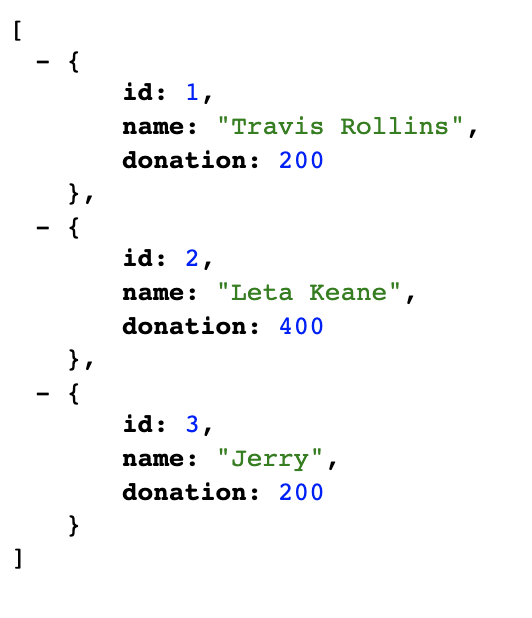

## Animal Rescue

### Set Up

Clone down this repo, install the dependencies, and start the server.  It should be running on `localhost:3001`

In a new directory, create a brand new frontend for this project using ` create-react-app`.  Make sure it is running on `localhost:3000`.

### Expectations / Rules

Build a React App that displays the animals that have been rescued!  The application will also display recent donations and a form to submit your own donation!

You will have 3 hours to build this application.

We do want to see good commit habits - atomic commits that log small, focused changesets. Don't worry about creating GitHub issues, though.

### Iteration 0

First thing we want to do is fetch some info for us to display. **Thunks are not required.**
You are going to want to grab all of the rescued animal data and populate a Redux store. You should also have `isLoading` and `hasErrored` properties in your store.

### Iteration 1

Once you've populated your redux store with your data you are going to want to display the data as a card. While we wait for our data to arrive please provide a loading message for the front-end. If there is an error fetching the data, please let the user know.

Things to display:
`img, name, species, description`

### Iteration 2

Next we want to fetch all of the donation data, populate that in the redux store, and display the data as a list as well. Your `isLoading` and `hasErrored` properties should also be reused for this functionality.

Things to display:
`name, donation`

### Iteration 3

Create a controlled form component to create a donation (look into the API documentation below to see what pieces of information are expected, and what datatypes it wants each piece to be). As a user types into the input fields, the component's state should change.

When the user clicks the `Donate!` button, the application should update the store.  The new donation should display with all of the existing donations.

### Iteration 4

When the user makes a donation, the application should make a post request to the API.  The new donation should still exist upon reloading the page.

**You may not have any fetch calls in any component other than App!**

(If you have time to refactor your fetch calls into a separate helper file, that is fine, but it is *NOT* a requirement for this application.)

### Endpoints

| url | verb | options | sample response |
| ----|------|---------|---------------- |
| `http://localhost:3001/api/v1/rescue-animals` | GET | not needed | Array of all existing animals rescued: `[{ id: 1, name: 'Nala', species: 'Mountain Lion', description: 'Although subject to previous animal abuse...', img: 'https://www.turpentinecreek.org/wp-content/uploads/2018/02/Nala-56782.jpg' }` |
| `http://localhost:3001/api/v1/donations` | GET | not needed | Array of all existing donations: `[{ id: 1, name: 'Travis Rollins', donation: 200 }, {id: 2, name: 'Leta Keane', donation: 400 }]` |
| `http://localhost:3001/api/v1/donations/` | POST | `{id: <Number>, name: <String>, donation: <Number>}` | New donation: `{ id: 1, name: 'Travis Rollins', donation: 200 }` |

Note: All of these endpoints will return semantic errors if something is wrong with the request.

### Sample Post

